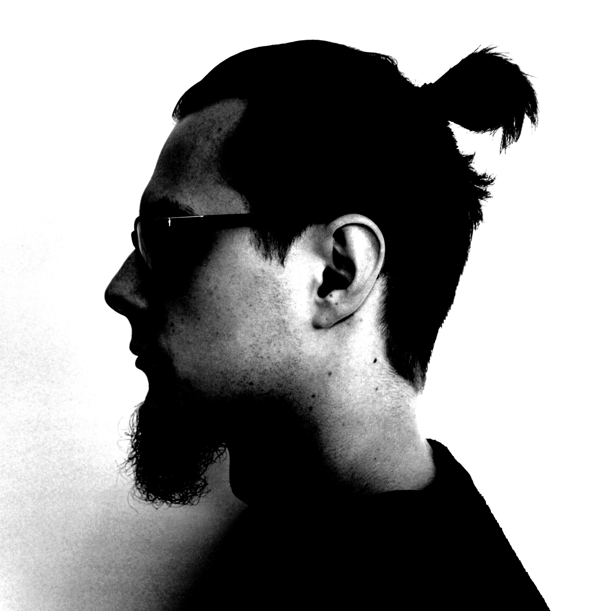

## Introduction

 I'm a Finnish student living in Vantaa, Finland. I study Phonetics as my major in Helsinki University. On the side of my studies I work at musical instrument sales and maintenance with expertise in guitars and basses. Additionally, I'm a semi-professional audio engineer. I love playing guitar, making music and listening to good music (especially on vinyl). Mostly I listen to progressive metal, but I do enjoy other musical genres as well. Please go check out my band Numento!

### My _Curriculum Vitae_

View on [Overleaf](https://www.overleaf.com/read/hpvzvvqgthdv)

## Find me on

[GitHub](https://github.com/attasika), [Instagram](https://www.instagram.com/attasika/)

## Contact

My email address is atte.asikainen@helsinki.fi

## Courses I've Taken

### Phonetics

Fonetiikan perusteet, fall 2014

Puheentutkimuksen tvt-taidot, fall 2014

Foneettinen tutkimuskirjallisuus, spring 2015

Foneettinen notaatio 1, fall 2014

Puheen akustiset analyysimenetelmät, spring 2015

Puheen tuottaminen, havaitseminen ja akustiikka, spring 2015

Johdatus puhetieteiden tutkimusmenetelmiin, spring 2017

Kokeellisen fonetiikan johdantokurssi, fall 2018

Puhe ja kieli, spring 2016

Prosodia, spring 2016

Tilastollisen analyysin perusteet puheentutkimuksessa, spring 2017

Puheen tuottaminen 2, fall 2015

Puheakustiikan harjoitustyö, spring 2016

Puheen havaitseminen 2, fall 2015

Soveltavaa ja monitieteistä fonetiikkaa, spring 2017

Proseminaari, fall 2016

Kandidaatintutkielma, fall 2018

[Fonetiikka kielen oppimisessa ja opetuksessa](https://courses.helsinki.fi/en/kik-407/125958538), spring 2019

[Määrälliset ja laadulliset tutkimusmenetelmät](https://courses.helsinki.fi/en/kik-lg220/126479654), spring 2019

Soveltava ja kliininen fonetiikka, spring 2019

Current Topics in Phonetics II: Digital Language Typology, spring 2019

### Logopedics

Logopedian perusteet, fall 2014

Ääni ja äänenlaatu, spring 2015

Fonologinen kehitys, fall 2015

### Speech Communication

Puheviestinnän perusteet, fall 2014

Puheviestintä, spring 2015

### Psychology

Neuro- ja kognitiivinen psykologia, fall 2014

Kliininen psykologia I: Terveyden ja mielenterveyden psykologia, spring 2015

Persoonallisuuspsykologia I, spring 2015

Kehityspsykologia I, fall 2015

Psykologisen tutkimuksen perusteet, summer 2016

### Musicology

Elektroakustisen musiikin historia ja analyysi, fall 2016

Tietokoneavusteinen musiikkianalyysi: musiikkisignaalin spektrianalyysi, spring 2017

Johdatus musiikitieteeseen, fall 2016

Johdatus tietokoneavusteiseen musiikintutkimukseen, spring 2016

Johdatus maailman musiikkikulttuureihin, spring 2017

Johdatus populaarimusiikin historiaan, fall 2015

Musiikkiakustiikka, spring 2016

Studioteknologia, spring 2016

Studioteknologian erityisalueita: Tuottajatuutorointi Studioteknologiakurssilla, spring 2017

Lauluntekeminen, spring 2016

### Languages

Toisen kotimaisen kielen suullinen ja kirjallinen taito, spring 2016

English Academic & Professional Skills: Reading, Writing & Spoken Communication, fall 2015

Tieteellinen kirjoittaminen, spring 2015

Viro I, fall 2018

Viro II, spring 2019

Viro III, fall 2019

### Linguistics

Yleisen kielitieteen peruskurssi, fall 2014

Fonologian ja morfologian harjoituskurssi, fall 2016

Introduction to language technology, fall 2019

### Other

[Introduction to Digital Humanities](https://courses.helsinki.fi/en/lda-h501/130806489), fall 2019

TVT-ajokortti, Käyttäytymistieteellisen tiedekunnan opiskelijoille, fall 2014

## Projects

_Photo from https://www.maketecheasier.com/upgrade-ubuntu-from-command-line/_

[The command line course](https://github.com/attasika/cmdline-course) is my first Github project. On the particular course I learned basic command line skills and some text processing functions the command line platform can offer.

## Misc. 

### Listen to Numento

[Spotify](https://open.spotify.com/artist/3t5HzeySOZvzNSEpvDiA5M?si=YThHLhJDT8Wfvk8UYanmog), [Bandcamp](https://numento.bandcamp.com)

### Numento at Social Media                                                                                              

[Instagram](https://www.instagram.com/numentoband/), [Facebook](https://www.facebook.com/numentofin/), [YouTube](https://www.youtube.com/channel/UC_3YNrisPhQufU6IJmOEnMg)

### CAST A VOTE FOR NUMENTO IN THE TUSKA-TORSTAI COMPETITION!
**Instructions:**  
1. Open [the link to competition website](http://www.tuska-torstai.fi/bands3.html)
2. Scroll down until you see Numento
3. Hit the _like_ button at Numento
4. You're done! Thanks for your help! ^^

_Voting closes on January 12. 2020_

